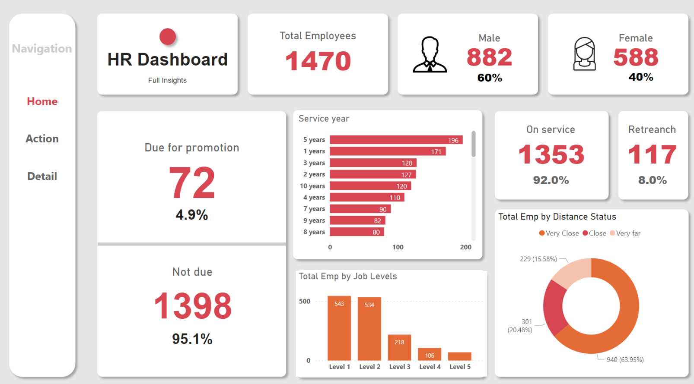
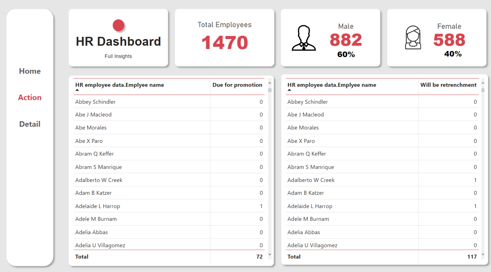
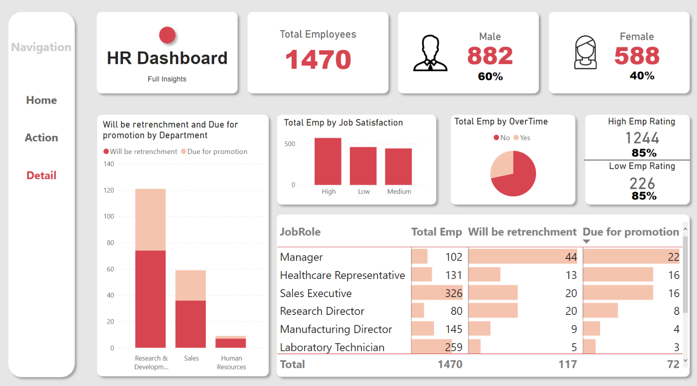

# Human-Resources-Power-BI-Dashboard

In order to show significant metrics in the HR departament I made this dashboard show all the important data

This report have to 3 pages:

## Home:
Here we show all the relevant data of the departament such as how many peaple have the company on service, the genres, how many peaple are duo to promotion or not, how the employees lie from de company and others general information

## Action:

In this page we show the datails of the employees that are duo for promotion and the employees that need to be retrenchment

## Detail:

The detail page shows all the metrics by departament in order to analyce the general situation of the company

